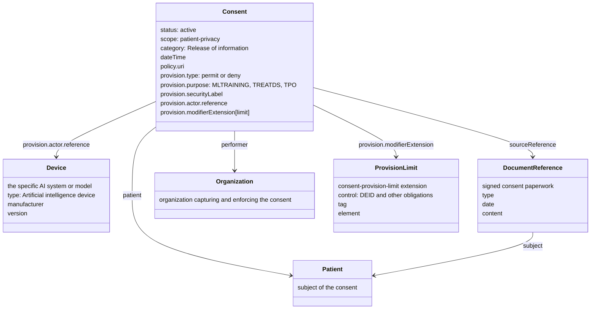

<div markdown="1" class="dragon">

This is an experimental IG. The content is fully from the perspective of the author, and is not endorsed by HL7 or any other organization. It is intended to be a discussion starter, and to solicit feedback from the community.

</div>

Shows how a Consent resource can be used to express permit or deny use of AI for a given patient.

<div markdown="1" class="stu-note">

<br/>
This IG is founded on HL7 FHIR Revision {{site.data.fhir.version}} found at [{{site.data.fhir.path}}]({{site.data.fhir.path}})
<br/>
</div>

### Scope

There are various use-cases where a Patient might consent or dissent to various uses of AI.

1. A patient might consent to use of AI for clinical decision support
2. A patient might deny use of their data for training of AI.
3. A patient might consent to use of their data in de-identified form for training of AI.

Given the Consent model, the Patient might be indicated in a Consent authorizing either

- Generically allowing or denying AI by PurposeOfUse
- Specifically allowing or denying a specific AI by referencing the Device resource for that AI.

A Consent is the healthcare organization's actionable record of the patient's decision. It should carry only rules that an access-control engine can evaluate and that the organization can actually enforce. The signed paperwork that captures the ceremony of the consent remains the authoritative legal record, and is referenced from the Consent.

### Resource Model



### PurposeOfUse

The most clean method is to use the PurposeOfUse as the basis for the provision in the Consent. This allows the Consent to be independent of the specific AI system or model, and thus not require updates as new AI systems or models are developed. The PurposeOfUse can be used to indicate the reason for the AI access, such as `MLTRAINING` for training of AI, or `TREATDS` for clinical decision support.

Further we look to [PurposeOfUse Vocabulary](https://terminology.hl7.org/ValueSet-v3-PurposeOfUse.html) to indicate what the reason the AI is giving for accessing data. For example, the PurposeOfUse of `MLTRAINING` is defined for when an AI is looking to train on data. The PurposeOfUse of `TREATDS` is defined for when an AI is looking to provide clinical decision support, or `PMTDS` when AI is looking to provide analysis for payment decisions.

The use of PurposeOfUse does require that any accesses the AI does, or an agent feeding the AI, must use the given PurposeOfUse code when accessing data. This is a trust model that the AI or the agent feeding the AI will accurately indicate the PurposeOfUse when accessing data. However, this is a common trust model used in many other aspects of healthcare data access and thus is not unique to AI.

#### Allow AI for ML Training

```fsh
* provision.type = #permit
* provision.purpose[+] = $purposeOfUse#MLTRAINING
```

Consent example: [Allow ML Training](Consent-AllowMLtraining.html)

#### Deny AI for ML Training

```fsh
* provision.type = #deny
* provision.purpose[+] = $purposeOfUse#MLTRAINING
```

Consent example: [Deny ML Training](Consent-DenyMLtraining.html)

#### Allow AI for Clinical Decision Support

```fsh
* provision.type = #permit
* provision.purpose[+] = $purposeOfUse#TREATDS
```

Consent example: [Allow AI for Clinical Decision Support](Consent-AllowCDS.html)

#### Deny AI for Clinical Decision Support

```fsh
* provision.type = #deny
* provision.purpose[+] = $purposeOfUse#TREATDS
```

Consent example: [Deny AI for Clinical Decision Support](Consent-DenyCDS.html)

### Specific AI Systems or Models

For this we look to current identification of [AI as a FHIR Device resource](https://build.fhir.org/ig/HL7/aitransparency-ig/StructureDefinition-AI-Device.html). This Device would be indicated in a Consent when a specific AI system or model is identified in a `Consent.provision.actor.reference` with a `permit` or `deny` provision.

This model requires that all access by an AI are attributed to the FHIR Device describing the AI. This might not be the case given how the AI is orchestrated. This model also is fragile as a new model or software would be a new Device, and thus would require a new provision in the Consent to indicate consent or dissent for that new AI.

#### Allow a specific AI for a specific purpose

In this case there is simply a provision indicating that the AI is permitted for a given purpose. There are no restrictions on the kinds of actions or the kinds of data, but those could be added as additional restrictions.

```fsh
* provision.type = #permit
* provision.purpose[+] = $purposeOfUse#TREATDS
* provision.actor[0].reference = Reference(AIdevice)
* provision.actor[0].role.text = "CDS"
```

Consent example: [Allow specific AI for specific purpose](Consent-AllowSpecificAIforSpecificPurpose.html)

### Limitations on AI Access

In the FHIR Consent/Permission there is a concept of a "limit" which is limits placed on a `permit` provision/rule. Where the limit might be an obligation or refrain, might be a specific additional data tag, or might be explicit removal of data elements.  A "limit" should never be allowed to expose data where that limit can't be enforced. Specifically meaning that the recipient of the data must be trusted to enforce the obligation or refrain indicated. [Extension Registry Consent Provision Limit](https://build.fhir.org/ig/HL7/fhir-extensions/StructureDefinition-consent-provision-limit.html)

#### Allow AI for ML Training on De-Identified Data

```fsh
* provision.type = #permit
* provision.purpose[+] = $purposeOfUse#MLTRAINING
* provision.modifierExtension[limit].extension[control].valueCodeableConcept = $obligation#DEID 
```

Consent example: [Allow ML Training on De-Identified Data](Consent-AllowMLtrainingOnDeIdentifiedData.html)

### Combining AI provisions with normal clinical use

FHIR R4 Consent has only ONE root level `provision`. That root establishes the overall direction, and each nested `provision` is an exception to the rule immediately above it, alternating between `permit` and `deny` at each level. To express several independent AI rules alongside the usual Treatment, Payment, and Operations rules, the nesting therefore has to be deeper than the rules themselves suggest.

```text
permit all of the addressed purposes
  deny ML training for sensitive data
    permit ML training for de-identified Normal data
  deny -- only so a refined permit can be expressed
    permit TPO for Normal confidentiality
    permit TPO for the care team including sensitive data
```

Note that R4 Consent does not define what applies when none of the provisions match; FHIR R6 adds a default rule at the top level.

Consent example: [Consent with all kinds of Provisions](Consent-AllAiProvisions.html)

### Conclusion

The above examples are showing simply how a Consent.provision iteration can carry permit and deny to indicate consent or dissent for AI. The examples are not exhaustive, and there are many other combinations of provisions that could be used to indicate consent or dissent for AI. The examples are also not indicating any specific data elements that are being allowed or denied, but those could be added as additional restrictions on the provision.

The reader should be able to take a quilted Consent that has various provisions indicating consent or dissent for various clinical use (TPO), and add in provisions indicating consent or dissent for various AI use-cases, and thus have a single Consent that indicates the patient's preferences for both traditional clinical use and AI use.

### Source

The source code for this Implementation Guide can be found on [GitHub](https://github.com/JohnMoehrke/ConsentAboutAI). See also the [Downloads and Analysis](download.html) page.
